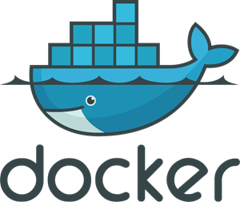

<h1 align="left" id="macropower-title">:wave: Hello there! I'm Nikhilesh S</h1>
<h3 align="left">I am student software Engineer Sri Venkateswara College of Engineering</h3>

  

- :seedling: &nbsp;I’m currently learning **Node.js**
- :speech_balloon: &nbsp;I like to talk about **Tech**, **Football** and **Movies**
- :mailbox: &nbsp;View my **[resume]**
- :computer: &nbsp;Connect with me on **[LinkedIn]**

 

<h2 align="left" id="macropower-tech">Favorite Tech</h2>

> Tools, languages, and other things that I like to work with.

<table>
  <tr>
    <td align="center" width="96">
      
       JavaScript&nbsp;
    </td>
    <td align="center" width="96">
      
       Python
    </td>
    <td align="center" width="96">
      
       C++
    </td>
    <td align="center" width="96">
      
       Node.js
    </td>
    <td align="center" width="96">
      
       Express.js
    </td>
    <td align="center" width="96">
      
       Docker
    </td>
    <td align="center" width="96">
      
       Git
    </td>
    <td align="center" width="96">
      
       flask
    </td>
    <td align="center" width="96">
      
       Socket-io
    </td>
  </tr>
  <tr>
    <td align="center" width="96"> 
      
       Firebase
    </td>
    <td align="center" width="96">
      
       Mongo DB
    </td>
    <td align="center"  width="96">
      
       My SQL
    </td>
    <td align="center"  width="96">
      
       Postman
    </td>
    <td align="center" width="96">
      
       NumPy
    </td>
    <td align="center"  width="96">
      
       Pandas
    </td>
    <td align="center" width="96">
      
       CSS
    </td>
    <td align="center" width="96">
      
       HTML
    </td>
    <td align="center" width="96">
      
       Thanos
    </td>
  </tr>
</table>

<!-- links -->

[84.51°]: https://github.com/8451 "84.51° Github Home"
[resume]: https://drive.google.com/file/d/1XSp5_WLijI1q81RpOn4Z2-VmPjYiI_f9/view?usp=sharing
[linkedin]: https://www.linkedin.com/in/nikhilesh-s "Jacob Colvin LinkedIn"
